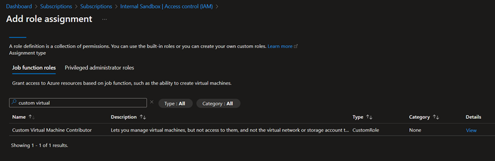

# Custom Roles

At times the built-in roles ([Azure built-in roles](https://learn.microsoft.com/en-us/azure/role-based-access-control/built-in-roles)) in Azure is not sufficient to meet organizational policies, and this is when Custom Roles come into play, allowing for very granular rights management.

## Custom Role design workflow

Below are a couple of steps to consider when designing/modifying a Custom Role in Azure. 

1. Consider the [Azure built-in roles](https://learn.microsoft.com/en-us/azure/role-based-access-control/built-in-roles) and see if you can find one that is closest to what is needed
1. Create a role based on the selected role above, adjust the [Input format](https://learn.microsoft.com/en-us/azure/role-based-access-control/custom-roles#input-and-output-formats) to your prefered deployment method
1. Review the [Azure resource provider operations](https://learn.microsoft.com/en-us/azure/role-based-access-control/resource-provider-operations) and adjust the role definition as needed
1. Remember to test your new/updated role definition to ensure it does what is intended

## Steps to deploy

1. Modify [**AssignableScopes**](https://learn.microsoft.com/en-us/azure/role-based-access-control/role-definitions#assignablescopes), **Name** and **Description** properties for each of the role definition JSON files
1. Set appropriate values for the variables in **deploy-custom-roles.ps1**
1. Run **deploy-custom-roles.ps1** to deploy role definitions to the selected scope
1. If you go to **role assignments** for the scope you deployed the role definition to, you should now be able to see the role definition(s) you have deployed

   

&nbsp;

## Sample Custom Roles

### Backup Operator (custom)

Documentation (built-in role): [Backup Operator](https://learn.microsoft.com/en-us/azure/role-based-access-control/built-in-roles#backup-operator)

Modifications made:

- **Actions**
  - Removed **"Microsoft.RecoveryServices/Vaults/certificates/write"**
  - Removed **"Microsoft.RecoveryServices/Vaults/extendedInformation/write"**
  - Changed **"Microsoft.RecoveryServices/Vaults/monitoringConfigurations/*"** to **"Microsoft.RecoveryServices/Vaults/monitoringConfigurations/read"**
  - Changed **"Microsoft.RecoveryServices/Vaults/backupstorageconfig/*"** to **"Microsoft.RecoveryServices/Vaults/backupstorageconfig/read"**

### Virtual Machine Contributor (custom)

Documentation (built-in role): [Virtual Machine Contributor](https://learn.microsoft.com/en-us/azure/role-based-access-control/built-in-roles#virtual-machine-contributor)

Modifications made:

- **NotActions**
  - Added **"Microsoft.Compute/virtualMachines/restart/action"**

&nbsp;

## Related links

- Learn: [Azure built-in roles](https://learn.microsoft.com/en-us/azure/role-based-access-control/built-in-roles)
- Learn: [Azure custom roles](https://learn.microsoft.com/en-us/azure/role-based-access-control/custom-roles)
- Learm: [Tutorial: Create an Azure custom role using Azure CLI](https://learn.microsoft.com/en-us/azure/role-based-access-control/tutorial-custom-role-cli)
- Learn: [Azure resource provider operations](https://learn.microsoft.com/en-us/azure/role-based-access-control/resource-provider-operations)
  - *For identifying the specific actions/abilities each right in the role definition contains*
